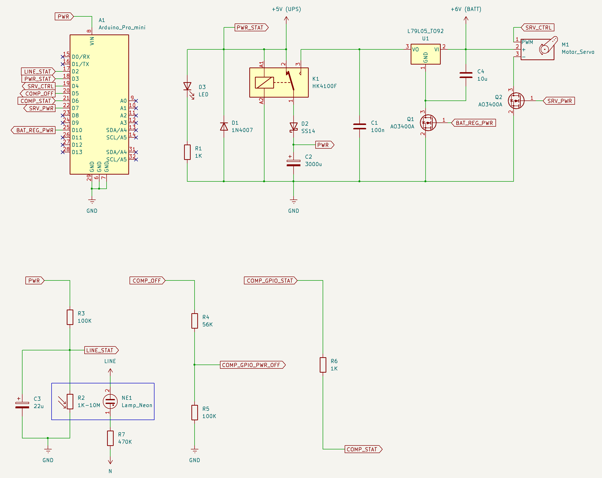
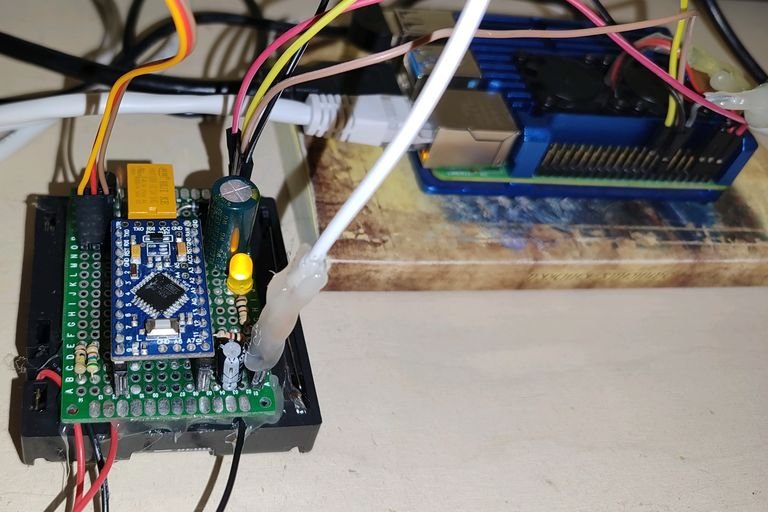
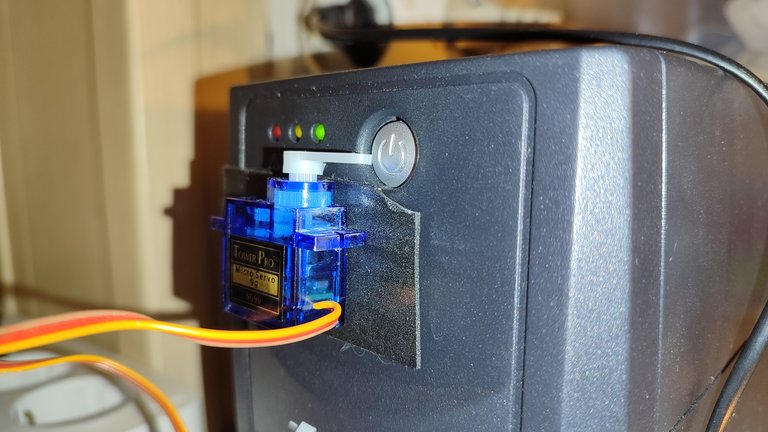
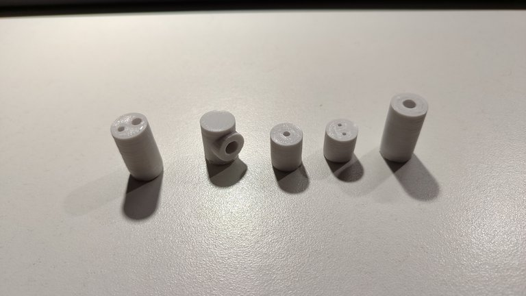
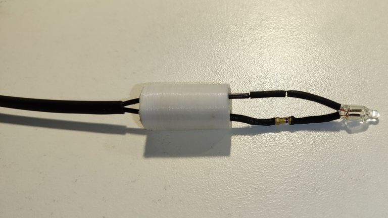
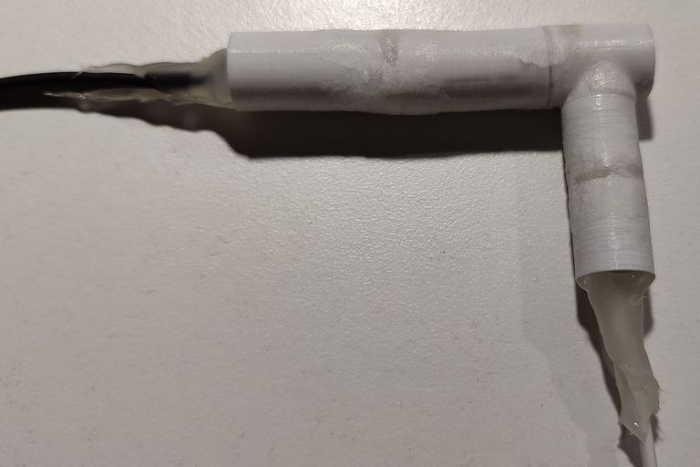
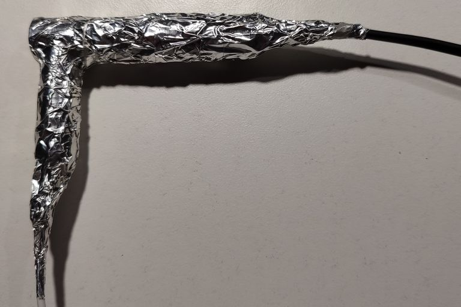
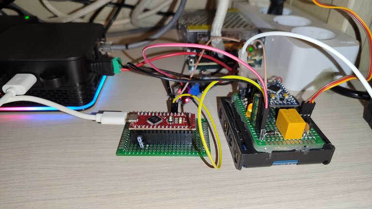

# Автоматическое выключение и включение домашнего сервера при перебоях с электричеством

Устройство, которое в момент отключения внешнего электричества подаёт сигнал на компьютер, чтобы тот выключился, ожидает его выключения и механически отключает источник бесперебойного питания (ИБП), к которому этот компьютер подключён. После возобновления электроснабжения - снова механически включает бесперебойник.

Состояние электросети отслеживает микроконтроллер в виде Arduino Pro Mini. Когда электричество отключают, то ардуино подаёт сингал на GPIO контакт. Если в роли компьютера выступает компьютер с GPIO, например Raspberry Pi, то он сразу получает сигнал на выключение. Если это обычный компьютер (без GPIO), то требуется ещё один промежуточный контроллер в виде Arduino Nano, который принимает сигнал от GPIO, а с компьютером связан через USB. Для включения и выключения бесперебойника используется сервомашинка, которая нажимает на кнопку на ИБП. Если электричество вернут в процессе отключения компьютера, то кнопка нажимается дважды, чтобы снова включить компьютер. Ожидая появления электричества, устройство работает от батареек. Скетч для прошивки Arduino Pro Mini - контроллера основного устройства находится в файле [controller/controller.ino](controller/controller.ino). А скетч для Arduino Nano (промежуточный контроллер для компьютеров без GPIO) в файле [comp/serial/controller/controller.ino](comp/serial/controller/controller.ino).



Для переключения источника питания устройства применяется пятивольтовое реле. На схеме используется HK4100F, катушка которого потребляет примерно 40 мА. Диод D1 служит для защиты от обратного тока при переключении катушки. При подаче питания на катушку устройство питается от внешнего источника. Катушка сразу подключена к внешнему питанию, поэтому как только оно появляется, то прибор сразу переходит на него.



При отключении питания катушка отключается и реле переключает питание на батарейное. Я использую 4 батарейки AA, что в сумме даёт напряжение 6В, поэтому требуется уменьшить его до 5 вольт. Для этого используется линейный 5В преобразователь L79L05 в корпусе TO92. Этот преобразователь в холостом режиме потребляет примерно 2,5 мА, поэтому будет сажать батарейки даже если устройство питается от внешнего питания. Чтобы этого не было, предусмотрен транзистор Q1, который полностью размыкает цепь связанную с батарейками, когда они не должны использоваться и открывается при переходе на батарейное питание при помощи сигнала от ардуино. О наличии внешнего питания ардуино судит по сигналу PWR_STAT.
Ещё для экономии батареек с Arduino Pro Mini удалены светодиод, который горит при наличии питания и преобразователь напряжения, который в данном проекте не используется, но потребляет ток. Каждый раз при переключении на батарейки микроконтроллер проверяет напряжение питания. И если оно будет ниже допустимого, то выдаст сообщение об ошибке путём моргания оставшегося светодиода (13-й пин). Проверка напряжения реализована путём переключения АЦП микроконтроллера на измерение внутреннего опорного напряжение 1,1 вольта. При этом опорное напряжение самого АЦП остаётся как обычно - напряжение питания. Поэтому результат измерения 1,1 вольта будет зависеть от напряжения питания.

Чтобы ардуинка не выключалась в момент переключения питания предусмотрен конденсатор C2 ёмкостью 3000 мкФ. Но одного конденсатора недостаточно, т.к. из схемы видно, что при отключении внешнего питания, катушка реле продолжит питаться уже от конденсатора и питание быстро не переключится. Чтобы этого избежать установлен диод Шоттки. Он съедает примерно 0,2 вольта входного напряжения, поэтому на ардуино приходит примерно 4,8 вольта.

Сервомашинка питается только от батареек. Чтобы электроника сервомашинки не сажала батарейки в простое, предусмотрен транзистор Q2, который открывается ардуиной только на время её работы. В проекте используется самая распространённая 9-граммовая серва. Она просто приклеивается к ИБП на толстый двухсторонний скотч. Для работы с сервой используется стандартная для ардуино библиотека [Servo](https://reference.arduino.cc/reference/en/libraries/servo/). Для настройки угла поворота, достаточного для нажимания кнопки, я сделал небольшую тестовую прошивку, которую можно залить в удобную для тестрования ардуино (Arduino UNO).

```c++
#define LED 13
#define SERVO_CONTROL 4
#include <Servo.h>

Servo _srv;

void setup()
{
  pinMode(LED, OUTPUT);
  pinMode(SERVO_CONTROL, OUTPUT);
  _srv.attach(SERVO_CONTROL);
  Serial.begin(9600);
  _srv.write(0);
}

int _angle = 0;

void loop()
{
  if (Serial.available())
  {
    _angle = Serial.readString().toInt();
    Serial.println(_angle);
    _srv.write(_angle);
    delay(500);
    _srv.write(0);
  }
}
```

В сериал мониторе нужно вводить градус поворота. Сервомашинка будет на этот угол поворачиваться, а затем возвращаться в нулевое положение. Нужно добиться, чтобы кнопка успешно нажималась и отжималась и сделать на градус два больше для запаса.



Ардуино общается с компьютером или промежуточной Arduino Nano при помощи GPIO. Всего используется два GPIO контакта: COMP_OFF и COMP_STAT.
* COMP_OFF - выходной сигнал Arduino Pro Mini (5-й pin). При высоком уровне на нём компьютер получает сигнал о необходимости выключится. Т.к. мини ПК с GPIO, например, Raspberry Pi использует 3-х вольтовую логику, то COMP_OFF преобразуется во входной сигнал COMP_GPIO_PWR_OFF для Raspberry Pi напряжением чуть меньше 3,3 вольта. Для этого используется делитель, в верхнем плече которого резистор на 56 кОм, а в нижнем - на 100 кОм.
* COMP_STAT - это входной сигнал Arduino Pro Mini (6-й pin) с внутренней подтяжкой к высокому уровню. Когда компьютер включается, он должен установить на этот контакт низкий уровень. Так устройство поймёт, что компьютер работает. COMP_STAT переходит в выходной для GPIO компьютера или промежуточной Arduino Nano контакт COMP_GPIO_STAT. На всякий случай связь сделана через резистор в 1 кОм.

Прибор должен получать информацию о наличии напряжения в розетке. Для этого собирается индикатор напряжения в сети в виде обычной неоновой лампочки NE-2 и фоторезистора. Лампочка питается от сети через резистор 470 кОм. Лампочка и фоторезистор помещаются в пластиковый корпус, изготовленный на 3D принтере. Их выводы помещаются в отдельные корпуса, которые служат для изоляции вывоводов. Ещё две детали служат для помещения в них подводящих проводов: 230В - к лампе и от прибора к фоторозеистору. После сборки отдельные части склеиваются цианокрилатным клеем с содой. Я печатал PETG платиком. Модели отдельных частей, а также исходный код для среды OpenScad лежат в папке [lineDetector](lineDetector)



Все оголённые выводы я дополнительно поместил в термоусадку:



Детектор в сборе:



Но какой бы толщины не были стенки, пластик всё равно пропускает свет. Поэтому, чтобы всё работало, нужно обернуть полученное изделие в фольгу. Для этого идеально подходит алюминиевый скотч.



В моём случае фоторезистор в полной темноте имеет сопротивление больше 200 МОм, а при освещение неоновой лампочкой - сопростивление падает примерно до 2 кОм. Сигнал LINE_STAT формируется из делителя напряжения, где фоторезистор входит в нижнее плечо. Верхнее плечо - резистор на 100 кОм. В этом случае сигнал LINE_STAT является инверсным: когда электричество есть на нём уровень около нуля, а при отключении сети: почти 5 вольт. Для того, чтобы убрать пульсации и случайные срабатывания ставится конденсатор C3. На схеме указан конденсатор на 22 мкФ. В этом случае детектор срабатывает аж почти через две секунды после отключения электричества в сети. Можно варьировать как удобно.

Программная часть для компьютера написана на языке Tcl. Для компьютеров с GPIO (Raspberry Pi) используется файл [comp/rpi_gpio/watcher.tcl](comp/rpi_gpio/watcher.tcl). В коде задан входным контактом 27-ой пин, выходным - 22-й пин. Управление GPIO в этом коде осуществляется через библиотеку [libgpiod](https://git.kernel.org/pub/scm/libs/libgpiod/libgpiod.git/about/). А именно, используются готовые утилиты для работы с GPIO. Для отслеживания входных сигналов применяется утилита gpiomon, а для установки выходных сигналов - gpioset. Одним из преимуществ такого подхода в управлении GPIO является то, что скрипт watcher.tcl имеет монопольный доступ к GPIO и пока его процесс не завершён, никакой другой процесс не может иметь доступа к используемым watcher.tcl GPIO контактактам, что положительно сказывается на безопасности. Библиотека libgpiod уже предустановлена в последних версиях Raspbian OS, но если нет, то её можно установить.

```
sudo apt install gpiod
```

Для автозагрузки watcher.tcl используется юнит Systemd:

```
[Unit]
Description=Service for communication with the UPS control device

[Service]
User=root
Type=simple
ExecStart=/usr/bin/tclsh /path/to/watcher.tcl

[Install]
WantedBy=multi-user.target
```

Для компьютеров без GPIO, использующих для связи с основным устройством дополнительную Arduino Nano исходный код расположен в файле [comp/serial/comp/watcher.tcl](comp/serial/comp/watcher.tcl). Эта программа в качестве параметра принимает путь к последовательному порту, к которому подключено Arduino Nano (обычно /dev/ttyUSB0). Этот путь следует добавить к ExecStart в юните выше. Алгоритм прост: Arduino Nano всё время шлёт "a\r\n". Когда watcher.tcl запускается и получает с последовательного порта эту команду, то она отсылает "+". Ардуино перестаёт слать "a\r\n" и уходит в глубокий сон (почти перестаёт потреблять энергию). Когда настаёт время выключить сервер, то ардуино просыпается и всё время шлёт "-\r\n".

Если используется Raspberry Pi, то устройство питается от выводов 5 вольт и земля самого одноплатника, т.к. на эти пины питания поступает напряжение даже если Raspberry Pi выключено. В случае обычного компьютера или мини ПК требуется организовать отдельное питание устройства от блока питания, подключённого к ИБП. В моём случае, например, я использовал блок питания самого компьютера с дополнительными выводами, и плату понижения напряжения для преобразования 12 вольт в 5 вольт.



Итак, для начала работы устройства, нажимаем кнопку reset на ардуино. Если всё нормально, то сначала сервомашинка издаст звук, означающий что устройство включилось и что качалка установлена на нулевой угол. Также, загорится светодиод - обозначающий, что ардуина включилась и пока ещё не ушла в сон. И через некоторое время он погаснет, обозначая, что микроконтроллер ушёл в глубокий сон. Всё. Мониторинг электросети включён. Если же после нажатия reset светодиод начал моргать, то значит нужно искать ошибку. При включении, микроконтроллер проверяет основные сигналы. В случае обнаружения ошибки, ардуино сообщит об этом путём мигания светодиода. Прежде всего устройство должно питаться от основного питания (не батарейки). В противном случае светодиод будет моргать раз в секунду. Эта же ошибка возникнет при сбоях при переключении бесперебойника, если он не включится или не выключится. Далее, проверяется наличие сетевого напряжения. В случае его отсутствия светодиод замигает 10 раз в секунду. Если всё нормально, устройство будет ждать включения сервера (пока не будет притянут к земле соответствующий контакт). Если в течении 3-х минут этого не произойдёт, то светодиод начнёт мигать 2 раза в секунду. И наконец, последняя ошибка - это низкий уровень батареек. Он проверяется при переключении на батарейное питание. В этом случае диод будет мигать 1 раз в 5 секунд. Во всех случаях мигание будет продолжаться 10 минут, потом ардуино уйдёт в сон.
